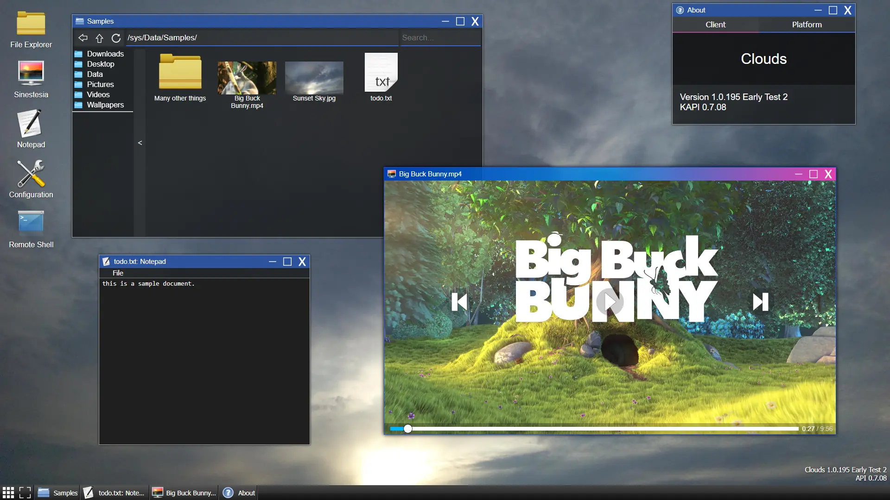

# :cloud: Clouds :cloud:
<div align="center">


</div>



## :question: What is it?
**Clouds** is a multi-purpose web environment, runnable locally on the user machine or on a server. The provided environment is accessible through any modern web browser, allowing its core functionality to be available on any number of devices, including but not limited to: PCs, Smartphones, Smart TVs, etc.

Here's a list of some things you can do with **Clouds**:

* Stream content from your computer or laptop to your TV;
* Manage local/remote media server files with an intuitive interface.
* Transfer files between your Phone and your computer with ease;
* View documents like PDFs on any capable browser directly in the UI;
* Invoke shell and sysadmin commands remotely from any of your devices;
* And more to come!

**Clouds** uses the concept of **apps** to perform many functionalities on its environment. **Apps** are separate from the core system, and can be developed independently from the rest of the project, allowing **flexibility** and most importantly **extensibility**.

## :file_folder: Structure

This project consists of two separate entities: The **API** and the **Client** core. 
- **API**: Encompasses all the functionalities pertaining to the services provided in the server. Targets the _server_ device. It uses **Node.js** with **Express** to provide a simple but powerful routing system consumed by the web client.

- **Client**: Encompasses all subsystems targeting the _client_ device, that is, the web browser accessing the web interface. Includes the classes responsible for the interface as well as the built-in **Apps**. Uses standard modern JavaScript, compiled through **Webpack** and **Babel** for better performance and support of older devices.

Directory|Purpose
:-|:-
api/modules/|Core classes used by the Node.js server.
api/pages/|Web pages loaded by the client when initializing the system.
client/apps/|Contains a folder for every built-in app available on the system. An app folder contains a manifest, modules and resources used by the app.
client/res/|Static general resources, accessible directly by the client web browser.
client/src/|Source code for the core client modules. These are compiled into final static resources.
config/|Configuration used by the server.
docs/|Files associated with the repo documentation.
usr/|Contains a folder for each user in the web system. Provides a dedicated space that can be used by the client user.

## :package: Building
Most of the project is already packaged for you. Only a few preparation build steps must be done.
* **Step 1:** Install dependencies. The core **API** depends on a few modules such as Express and EJS. **Client** requires build tools dependencies such as Babel and Webpack.
All of these dependencies can be installed with: ```> npm install``` on the root of a fresh clone of the repository.
* **Step 2:** Compile core **Client** Modules. The core modules used by the Client system must be compiled through Webpack in order to be available in the /client/res/ directory. You can invoke an npm script to do this compilation. Simply run ```> npm run dist``` in the root of a project.
* **Step 3:** You are done! You can configure the behavior of the server through the profiles stored in ```config/profiles/```. The default profile is already well configured, but you might want to change a few settings.

## :arrow_forward: Running
After building the project, running it is as easy as double-clicking the ```run``` script that matches your OS on the root of the project. You can also invoke _node_ directly with the same effect as the script. On a fresh terminal in the root, run the command ```> node .```.

This will instantiate a new server on the current machine and automatically start listening for new client connections. The terminal will stay open and log some of the user activities. Which activities are logged can be configured in the forementioned profiles stored in the ```config/profiles``` directory.

## :scroll: API Routes

Route|Maps to|Purpose
:-|:-|:-
/|/api/pages/entry|Initial page.
/test|-|Tests authentication status.
/page/|/api/pages/|Fetching of initial system pages, mainly login and desktop page.
/res/|/client/res/|Static resource access. All logged in users can access any content in this directory.
/app/**&lt;name&gt;**|/client/apps/**&lt;name&gt;**|Fetch static app resources.
/fsv/|_(User filesystem)_|Read/write file system access at the current path.
/shell/|-|Manage user remote shells.
/stat|-|Obtains system-wide status information.
/version|-|Obtains the current system version.